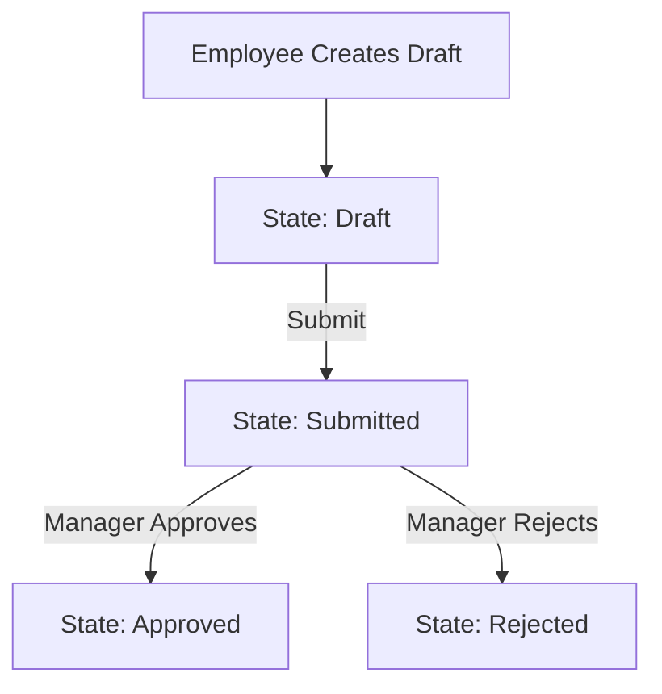

# ⏱️ employee_overtime

**Employee Overtime Request & Approval Workflow**

🚀 Workflow-Driven Requests • Role-Based Security • RPC-Safe Design • Audit-Ready

---

## 📃 Table of Contents

* [📦 Overview](#-overview)
* [✨ Features](#-features)
* [🔄 Overtime Request Workflow](#-overtime-request-workflow)
* [🔐 Security & Access Control](#-security--access-control)
* [📐 Technical Architecture](#-technical-architecture)
* [🧩 Folder Structure](#-folder-structure)
* [⚙️ Installation](#️-installation)
* [👮 Access Rights Matrix](#-access-rights-matrix)
* [🧪 Testing Matrix](#-testing-matrix)
* [📸 Screenshots](#-screenshots)
* [🎥 Demo Video](#-demo-video)
* [👨‍💻 Author](#-author)
* [📜 License](#-license)

---

# 📦 Overview

**Employee Overtime Management** is a production-ready Odoo module designed to manage **overtime requests**.

The module enforces a **strict request → approval workflow**, ensuring:

* Employees can only request overtime
* Managers control approvals and rejections
* All state transitions happen through **workflow buttons**
* Unauthorized writes (UI or RPC) are blocked at ORM level

---

# ✨ Features

## ⭐ 1. Employee Profile Management

* Lightweight employee profile model (`employee.profile`)
* One-to-one relation with `res.users`
* Employees can only see/read their own profile (if done by PRC, in UI it is restricted)
* Managers can manage all employee profiles

---

## ⭐ 2. Overtime Request Workflow

Employees submit overtime requests for **future dates only**.

**States:**

```
draft → submitted → approved / rejected
```

* Draft: editable & deletable by employee
* Submitted: locked for editing
* Approved / Rejected: final states

---

## ⭐ 3. Button-Only State Transitions (Core Design)

All workflow transitions are enforced through **explicit server-side buttons**:

* No direct state editing
* No bypassing workflow via RPC
* No UI-only security assumptions

This guarantees **data consistency and audit safety**.

---

## ⭐ 4. Role-Aware Write Protection

The module overrides `write()` and `unlink()` to enforce **business rules at ORM level**:

* Employees:

  * Can edit only draft requests
  * Can submit draft requests
  * Can delete draft requests
* Managers:

  * Can approve/reject submitted requests
  * Cannot manipulate workflow out of order

Invalid transitions are blocked even via manual RPC calls.

---

## ⭐ 5. Planned Overtime Validation

* Overtime dates cannot be in the past
* Overtime hours must be between **0 and 24**
* Employees without a linked profile **cannot submit requests**

---

## ⭐ 6. Chatter & Audit Trail

* Full chatter integration
* Automatic tracking of state changes
* Activity support for future extensions

---

# 🔄 Overtime Request Workflow



---

# 🔐 Security & Access Control

This module demonstrates **layered Odoo security design**:

### ✔ Access Control Lists (ACLs)

* Model-level CRUD control per role

### ✔ Record Rules

* Employees see only their own requests
* Managers see all requests

### ✔ ORM-Level Guards

* `write()` and `unlink()` overrides block invalid operations
* Protection applies to UI **and** RPC calls

This prevents:

* Workflow skipping
* Unauthorized edits
* Accidental data corruption

---

# 📐 Technical Architecture

## 🏗 Models

| Model               | Description                                |
| ------------------- | ------------------------------------------ |
| `employee.profile`  | Employee information & user linkage        |
| `employee.overtime` | Overtime request lifecycle & approval flow |

---

# 🧩 Folder Structure

```
employee_overtime/
│
├── models/
│   ├── employee_profile.py
│   ├── employee_overtime.py
│
├── views/
│   ├── employee_profile_view.xml
│   ├── employee_overtime_view.xml
│   ├── menu.xml
│
├── security/
│   ├── security_groups.xml
│   ├── ir.model.access.csv
│   ├── ir.rule.csv
│
└── __manifest__.py
```

---

# ⚙️ Installation

### 1. Copy module into addons directory

```bash
/odoo/custom_addons/employee_overtime/
```

### 2. Update App List

Go to:
**Apps → Update Apps List**

### 3. Install Module

**Employee Overtime Management**

Dependencies:

```
base
mail
```

---

# 👮 Access Rights Matrix

| Feature                    | Employee | Manager |
| -------------------------- | -------- | ------- |
| View own overtime requests | ✔        | ✔       |
| View all requests          | ✖        | ✔       |
| Create request             | ✔        | ✔       |
| Edit draft request         | ✔        | ✔       |
| Delete draft request       | ✔        | ✖       |
| Submit request             | ✔        | ✖       |
| Approve / Reject request   | ✖        | ✔       |
| Manage employee profiles   | ✖        | ✔       |

---

# 🧪 Testing Matrix

| Scenario                          | Status |
| --------------------------------- | ------ |
| Employee profile auto-selection   | ✅      |
| Draft request creation            | ✅      |
| Draft edit & delete by employee   | ✅      |
| Submit workflow                   | ✅      |
| Approval / rejection by manager   | ✅      |
| Invalid state transitions blocked | ✅      |
| RPC write protection              | ✅      |
| Record rule enforcement           | ✅      |
| Chatter & tracking                | ✅      |

---

# 📸 Screenshots

```
/images/overtime_form.png
/images/overtime_tree.png
/images/employee_profile_form.png
```

---

# 🎥 Demo Video

```
https://yourvideolink.com
```

---

# 👨‍💻 Author

**Ahmed Abdelgadir**
Junior Odoo Developer

---

# 📜 License

Licensed under **LGPL-3**
